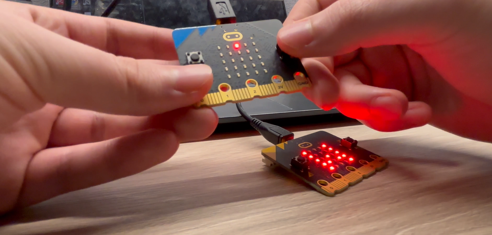

# Guess the Pixel (micro:bit v2, 2-device game)

A tiny two-micro:bit party game. One micro:bit (the **Selector**) secretly chooses a pixel on the 5×5 LED grid. The other micro:bit (the **Guesser**) tries to find it in up to 8 attempts. Devices communicate via the micro:bit radio (group 42).

> ## ▶ Watch a 1-minute showcase video  
> **[Click here to watch on OneDrive](https://1drv.ms/v/c/4d75d128dc6af497/ETwCvzy1h45JpW36HYJHfVgBWHaa5FulOn8f3scc10qPcg?e=3SknIe)**

---

## 🎮 How to Play

1. Power on both micro:bits.
2. **Selector**: Move the cursor with **A** and **B** to any LED and press **A+B** once to mark your secret pixel. If you change your mind you can still move around. Press **A+B** again on the selected pixel to **send** it to the Guesser (you’ll briefly see “T” for transmission).
3. **Guesser**: After you see **T**, you’re active. Move the cursor and press **A+B** to **guess**.
   - Correct guess → happy face, round ends.
   - Wrong guess → that pixel is dimly marked; try again (max 8 attempts).
   - Run out of attempts → sad face, round ends and game rests.
4. The Selector automatically resets (“R”) and can pick a new pixel. Repeat!

---

## 🔈 On-device Feedback

- **Selector**
  - After sending the pixel: shows **“T”** and plays a happy tone, then dims the chosen pixel.
  - When a round ends: shows **“R”** and resets for a new selection.
- **Guesser**
  - Waiting for a selection: shows **“W”**.
  - On receiving a selection: shows **“T”** briefly, then becomes active.
  - **Win**: happy face + tone.
  - **8 misses**: sad face + tone.

---

## 📡 Radio

- Radio **group**: `42`
- Message format (3 bytes):
  - From Selector → Guesser: `[0, x, y]` means **new selected pixel** at `(x, y)`.
  - From Guesser → Selector: `[1, 0, 0]` means **round finished** (win or max attempts).

